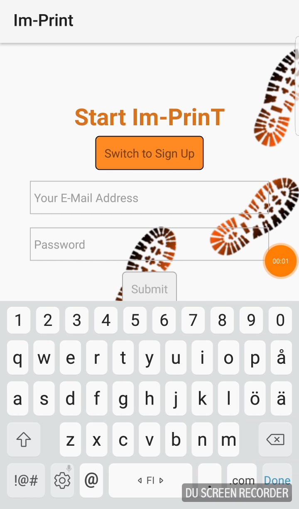

# Full-Stack React Native Image Sharing App

### Table of contents

*   [Overview](#overview)
*   [Demo](#demo)

### Overview

This is a Full-Stack React Native Image Sharing App where people can register/log-in  
and share image and the uploader's location using google maps API.  
Technologies used:
*   React Native
*   Redux
*   Firebase
*   Android Studio

### Demo

 
 

 
 

